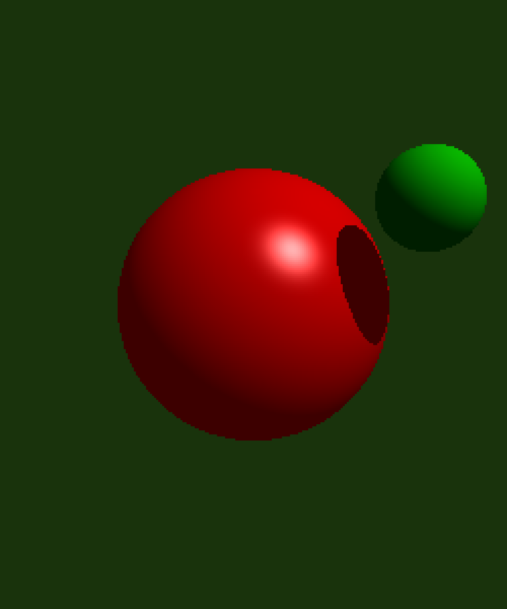
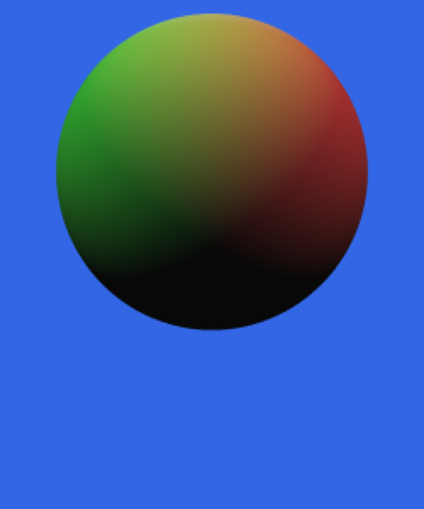
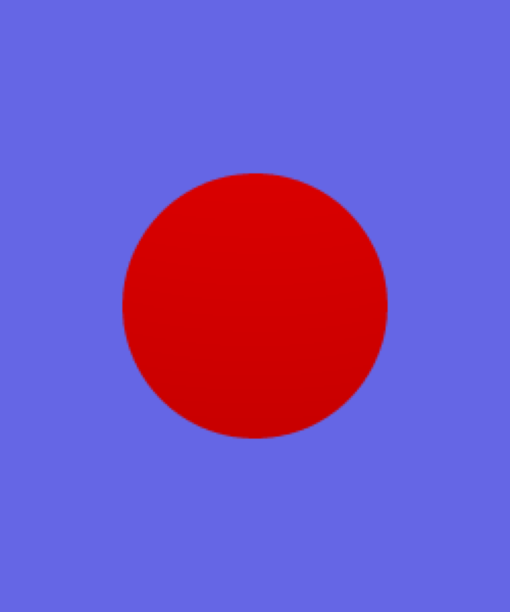
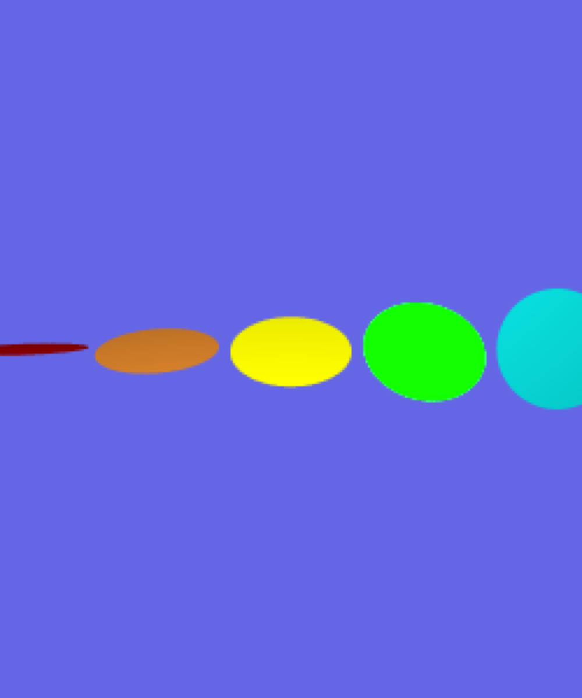
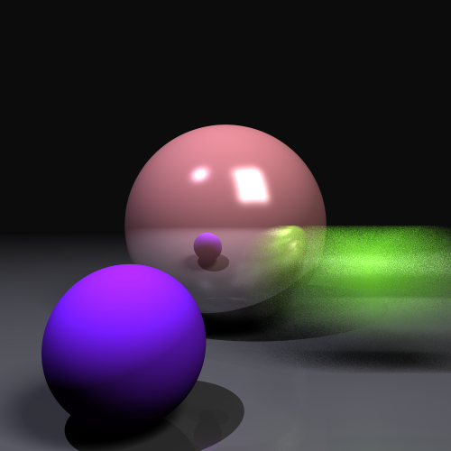

# Ray Tracer 

A simple ray tracing renderer program using three.js that renders spheres and disks illuminated by a light source. Supports area lights, distribution ray tracing, soft shadows, anti-aliasing, and reflection.

This project was for CS 3451 Computer Graphics course taught by Professor Blair MacIntyre at Georgia Tech.

## Project Goals

1. Initialize the scene
2. Cast eye rays for each pixel
3. Implement detection of ray intersection with spheres
4. Implement the shading equation
5. Create disk objects, including a ray/disk intersection routine 
6. Create area light sources
7. Enable shadow creation by light sources
8. Shoot multiple rays per pixel (super-sampling), and use these for anti-aliasing. 
9. Create multiple light rays per surface point being shaded, and use these for soft shadows as well as a specular highlights
10. Implement reflection using recursion

# Results

NOTE: all of the images here are generated with the parameters `super(div, 500, 600, 250, 300)` in the constructor, except the final high quality renders at the bottom.

Below are the images that your program should generate for the sample scenes, when you press the keys "1234567890-=". No scene is generated when the program starts, you will just see a light yellow canvas. 

           

(Note: these and other images, are store in full resolution in the project, if you would like to examine them closer.)

Each of these scenes will be slightly improved if you turn on supersampling before rendering them, which performs anti-aliasing, soft shadows, and area light specular highlights.  Because you will shoot and average together multiple slightly different rays per pixel, the silhouettes of objects will blend together more cleanly instead of showing stair-steps, the shadows will be smoother, and the specular highlights will fill in. To get these anti-aliased images, you should type the character "r" before rendering the given scene, which sets the sample level to 4, and type the character "j" to turn on jittering.

           

If we zoom in on the final scene, we can see the antialiasing on the sphere edges, the area shadows (combined with the sharp point shadow) and the highlights from the area and point light.


Here is this final image, with various levels of antialiasing (qweru) and non-jittered distributions:

    

Here is this same final image, with jittered distributions:

    

Especially without only 1 ray, or with a small number of rays, you can see very dramatic differences between the two, with the results getting better as the number of rays increases.

Here is this images from above with reflection, stating with no distribution and continuing with jittered distributions above) (these would be generated with "g=", "jg=", "wjg=", "ejg=", "rjg=" and "ujg="):

      

Finally, here is a high quality "pjg=" run at full resolution:


# Scene Description Language

Below are the function descriptions I had to implement for this project. The descriptions are written by Professor Blair MacIntyre.

#### `reset_scene ()`

Initialize all the data structures and variables so you can start with an empty scene.

#### `set_background (r, g, b)`

Sets the background color. If a ray misses all the objects in the scene, the pixel should be given this color.

#### `set_fov (angle)`

Specifies the field of view (in degrees) for perspective projection.  You will need to convert this to the focal length d.  You will then use this together with the eye position and the u, v, and w vectors of the eye's rotation matrix to create the eye rays.

#### `set_eye (cx, cy, cz, lx, ly, lz,  ux, uy, uz)`

Specifies the eye position (cx,cy,cz) in 3D coordinates along with a lookat point (lx,ly,lz) that define the position and direction the camera is looking. An up vector (ux, uy, uz) allows you to set the full orientation of the camera.

#### `new_light (r, g, b, x, y, z)`

Create a point light source at position (x,y,z) and its color (r, g, b). Your code should allow at least 10 light sources. For the second part of this assignment, you will cause these lights to cast shadows.

#### `ambient_light (r, g, b)`

Create an "ambient" light with color (r, g, b), in order to approximate indirect illumination. There is only one ambient light; multiple calls will just replace the ambient light.

#### `new_sphere  (x, y, z, radius, dr, dg, db, k_ambient, k_specular, specular_power)`

Specifies the creation of a sphere with its center at (x, y, z) and with a given radius.  The diffuse color of the sphere is given by (dr, dg, db).  The coefficient k_ambient specifies how much of the ambient light combines with the diffuse color of the surface.  For this project, we will assume that all specular highlights are white, and the brightness of the highlight is given by k_specular. The tightness of the highlight is guided by specular_power.

#### `new_disk  (x, y, z, radius, nx, ny, nz, dr, dg, db, k_ambient, k_specular, specular_power, vx?: number, vy?: number, vz?: number)`

Specifies the creation of a disk with its center at `c = (x, y, z)`, with a given `radius`, and with a surface normal `n = (nx, ny, nz)`.  The diffuse color of the sphere is given by `dr, dg, db`.  The coefficient `k_ambient` specifies how much of the ambient light combines with the diffuse color of the surface.  For this project, we will assume that all specular highlights are white, and the brightness of the highlight is given by `k_specular`. The tightness of the highlight is guided by `specular_power`. 

#### `area_light (r, g, b, x, y, z, ux, uy, uz, vx, vy, vz)`

Create an area light source at center position `c = (x,y,z)` and its color `(r, g, b)`. Your code should allow at least 10 area light sources.  The vectors `u = (ux, uy, uz)` and `v = (vx, vy, vz)` define a rectangle that gives off light. Specifically, points on the light source can be parameterized by values `s` and `t` in the range of `[-1, 1]`, which define points at positions `p = c + su + tv`. 

When only a single eye ray (no distribution) is used, area lights behave similarly to point lights, shooting a single light ray to their center point.

When more than one ray is used for each pixel (set by the `set_sample_level()` command), you should calculate shadows based on distribution ray tracing.  For each of the rays for a given pixel, you will calculate a distribution of sample positions on the area light source and use them as the light positions for shadow rays. You should calculate these sample positions on the area light by varying s and t in a grid pattern, l. 

For each of these rays you will compute the light contribution in two steps.  For the diffuse contribution, you should compute the contribution per ray, including shadowing, and then average the contribution for all light rays.  For the specular component, if any of the light rays is not shadowed, then you should compute the full specular contribution for that point.

As with point light sources, you do not actually draw the area light sources.  

#### `set_sample_level (level)`  

This method saves the sample level. The `level` is the amount of rays that will be shot per-pixel, for the purposes of anti-aliasing and soft shadows (distribution ray tracing). For level = 1, the default, just a single ray will be shot per-pixel, and all shadows will be hard shadows. For integer values of level greater than one, you will shoot multiple rays per pixel, and these rays will be spaced evenly through different sub-pixels in the pixel in a square grid pattern.  When level = 2, you will shoot 2 x 2 = 4 rays.  For level = 3, shoot 3 x 3 = 9 rays.  In general, you will shoot level x level rays per pixel. The final color of a pixel should be the average of the colors from each of these rays.

When using area light sources (see above) you will be shooting shadow rays towards various parts of the area light sources.  This will give you the effect of soft shadows.

This command is not found in any specific test scene.  Instead, various levels of sampling are set by typing one of the following characters before you render a scene: "qwertyuiop".   Typing "q" sets the sample level to 1.  Typing "w" sets it to 2, and so on up to "p" setting the sample level to 10 (which cause 10x10 = 100 rays to be shot per pixel).

#### `jitter_off()`

This is the default setting for whether to perform jittered sampling.  When jitter is off, you will use a regular grid pattern for creating the position samples on area light sources. Your "soft" shadows will look like overlapping dark regions. Like the `set_sample_level()` command, this command is not used in any particular scene.  Instead, you type the character "n" before rendering a given scene.

#### `jitter_on()`

When jitter is turned on, you will add a slight bit of randomness to the eye rays and the positions of sample on the rectangle for area light sources.  The result will be that your antialiasing and soft shadows will be more smooth than what you get without jitter.  The soft shadows may appear to be noisy for small values used in `set_sample_level()`.  When using higher sample levels, the noise will be reduced.  Type the letter "j" before rendering a scene to call this command.  The regular grid and jittered samples should be selected as described on this slide in the recorded lecture.


#### `reflection_on()`and `reflection_off()`

An optional extra credit part of the assignment is to implement reflected rays (see below).  Pressing the "g" key turns on reflected rays, and "v" turns off reflected rays.  Default is off.

#### `draw_scene()`

Ray-traces the scene and displays the image in the canvas region in your browser.  We have provided this method, but you will need to implement two internal methods, `traceRay(ray)` and `eyeRay(i,j)`, that this method calls.  

# Results for Main assignment

NOTE: all of the images here are generated with the parameters `super(div, 500, 600, 250, 300)` in the constructor, except the final high quality renders at the bottom.

Below are the images that your program should generate for the sample scenes, when you press the keys "1234567890-=". No scene is generated when the program starts, you will just see a light yellow canvas. 

           

(Note: these and other images, are store in full resolution in the project, if you would like to examine them closer.)

Each of these scenes will be slightly improved if you turn on supersampling before rendering them, which performs anti-aliasing, soft shadows, and area light specular highlights.  Because you will shoot and average together multiple slightly different rays per pixel, the silhouettes of objects will blend together more cleanly instead of showing stair-steps, the shadows will be smoother, and the specular highlights will fill in. To get these anti-aliased images, you should type the character "r" before rendering the given scene, which sets the sample level to 4, and type the character "j" to turn on jittering.

           

If we zoom in on the final scene, we can see the antialiasing on the sphere edges, the area shadows (combined with the sharp point shadow) and the highlights from the area and point light.


Here is this final image, with various levels of antialiasing (qweru) and non-jittered distributions:

    

Here is this same final image, with jittered distributions:

    

Especially without only 1 ray, or with a small number of rays, you can see very dramatic differences between the two, with the results getting better as the number of rays increases.

# Submission

In addition to your code, you should generate an image using the command "pk=" at a full resolution of 500x600.  Name this file "submission-<your-gt-email-id>.png" and include it in the top level folder.

# Optional Components

In this assignment you have the option of implementing two additional features for extra credit.

## Extra credit 1:  Reflection (2 point)

For this extra credit, you will implement reflection rays. For each ray that strikes a triangle, if the maximum reflection depth (initially set as 5 on the line `maxDepth = 5;`) has been reached, you should not add any more reflections. Otherwise, you should generate a new reflection ray (by reflecting the current ray around the surface normal) and cast it into the scene. The color contribution of that ray should be adjusted using the `k_specular` surface property and added to the color of the pixel.

You should only generate one reflected ray per incoming ray, even if there are distributed rays being computed.

Here is this images from above, stating with no distribution and continuing with jittered distributions above) (these would be generated with "g=", "jg=", "wjg=", "ejg=", "rjg=" and "ujg="):

      

Finally, here is a high quality "pjg=" run at full resolution:


#### Submission

Inform your TA that you did this extra credit.  In addition to your code, you should generate an image using the command "pjg=" at a full resolution of 500x600.  Name this file "submission-reflection-<your-gt-email-id>.png" and include it in the top level folder.

## Extra credit 2: Motion Blur or Depth of Field (2 points)

You may earn a second extra credit point, only after you do the first extra credit, by implementing either motion blur or depth of field effects.

### Motion Blur

Motion blur is implemented on moving objects by observing that a single image captures a scene over a period of time.  During that time, the moving objects in the scene are captured at all locations they are in during that time period, with the results averaged together.  To using distribution ray tracing, we select a different location for each moving object for each ray shot. 

We have provided optional velocity values for the sphere and disk.  This velocity represents a +/- value around the objects location during the frame time, with the object being anywhere from  `x,y,z - vx,vy,vz` to `x,y,z + vx,vy,vz` during the time interval.  For each ray, you should chose one position for the object randomly, and render the scene using that time.  When many rays are shot per eye ray, using a different time for each ray will result in an average pixel color over many possible object locations.  A sample image on the final scene is this, captured by typing "pjgk="



#### Submission

Inform your TA that you did this extra credit.  In addition to your code, you should generate an image using the command "pjgk=" at a full resolution of 500x600.  Name this file "submission-blur-<your-gt-email-id>.png" and include it in the top level folder.

### Depth of Field

Depth of field is implemented by simulating a more realistic lens projection.  Our basic ray tracer shoots a ray from a single center of projection (a pinhole camera).  Real cameras have lenses with larger apertures, that collect light rays arriving at many directions, and focusing them on the image plane.  

Simulating a real lens is complicated (see the book, or sources on the internet).  Here, we simulate it with the following parameters for an eye ray:
- `lensSize` represents the size of the lens (the area that the origin of the eyeRays should be spread over)
- `depth1` represents the distance along the eye ray that the lens sits at
- `depth2` is the distance along the eye ray that is the focal plane.

The approach you should take is as follows.  When you have a distribution for an eye ray, instead of jittering the direction of the ray through the viewplane, you will instead 
- position a rectangle of size "viewplane pixel size * lensSize" along the eye ray at distance "depth1".
- distributed points over that rectangle
- use those points as the origin of your distribution rays, with their direction pointing at the point "depth2" distance along the original eye ray

In this way, each pixel creates a set of rays that focus through a single focal distance.

Averaging these values should generate an image with a depth of field effect, like this one captured by typing "pjgd="


#### Submission

Inform your TA that you did this extra credit.  In addition to your code, you should generate an image using the command "pjgd=" at a full resolution of 500x600.  Name this file "submission-depth-<your-gt-email-id>.png" and include it in the top level folder.

# Authorship Rules

The code that you turn in should be entirely your own. You are allowed to talk to other members of the class and to the instructor and the TA’s about general implementation of the assignment. It is also fine to seek the help of others for general Typescript and Web programming questions. You may not, however, use code that anyone other than yourself has written. The only exceptions are that you should use your code from Project 1A and the source code that we provide for this project. Code that is explicitly not allowed includes code taken from the Web, github, from books, from other students, or from any source other than yourself. You should not show your code to other students. Feel free to seek the help of the instructor and the TA's for suggestions about debugging your code.

# Submission

You will check out the project from GitHub Classroom, and submit it there.  

**Do Not Change the names** of the existing files (e.g., index.html, rayTracer.ts, etc).  The TAs need to be able to test your program as follows:

1. cd into the directory and run ```npm install```
2. run with ```npm run dev```
3. visit ```http://localhost:3000/index.html```

Please test that your submission meets these requirements.  For example, after you check in your final version of the assignment to github, check it out again to a new directory and make sure everything builds and runs correctly.
 
## Development Environment

The development environment is the same as used in previous assignments.

## License

<a rel="license" href="http://creativecommons.org/licenses/by-nc-sa/4.0/"></a><br /><span xmlns:dct="http://purl.org/dc/terms/" property="dct:title">Computer Graphics CS3451 Fall 2021</span> by <a xmlns:cc="http://creativecommons.org/ns#" href="https://github.blairmacintyre.me" property="cc:attributionName" rel="cc:attributionURL">Blair MacIntyre</a> is licensed under a <a rel="license" href="http://creativecommons.org/licenses/by-nc-sa/4.0/">Creative Commons Attribution-NonCommercial-ShareAlike 4.0 International License</a>.

The intent of choosing (CC BY-NC-SA 4.0) is to allow individuals and instructors at non-profit entities to use this content.  This includes not-for-profit schools (K-12 and post-secondary). For-profit entities (or people creating courses for those sites) may not use this content without permission (this includes, but is not limited to, for-profit schools and universities and commercial education sites such as Corsera, Udacity, LinkedIn Learning, and other similar sites).
