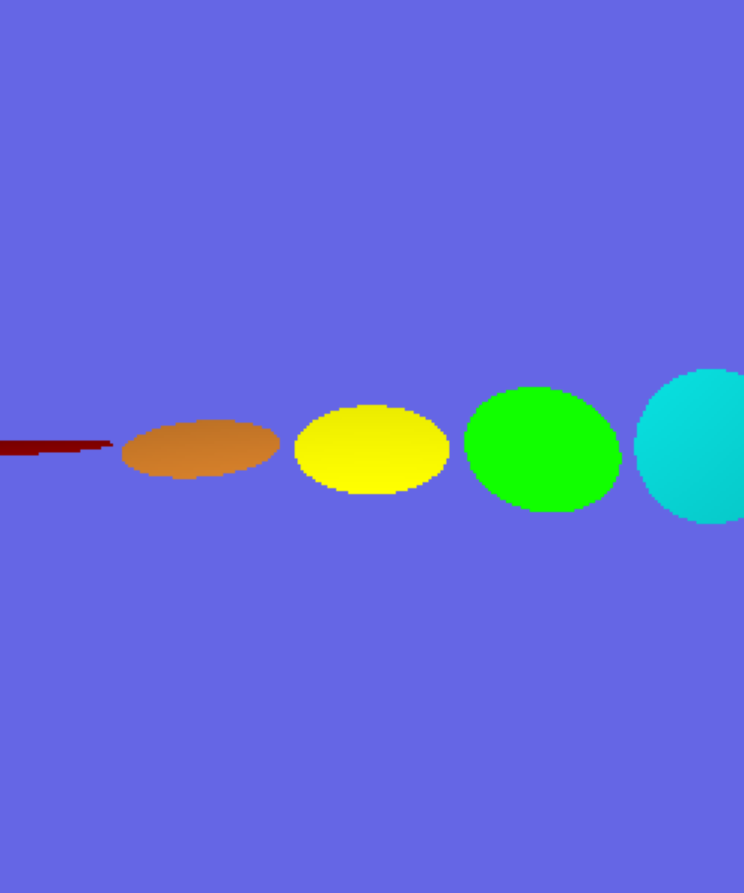
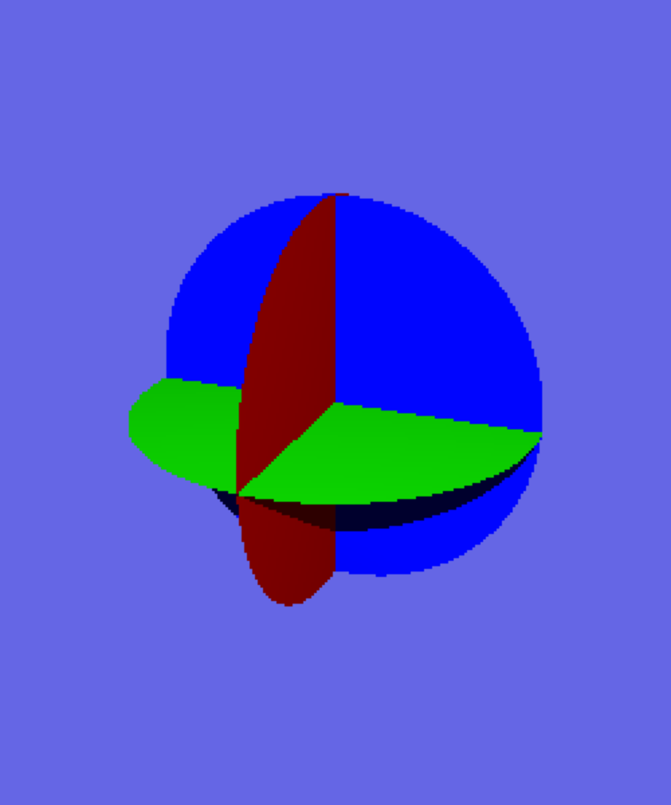
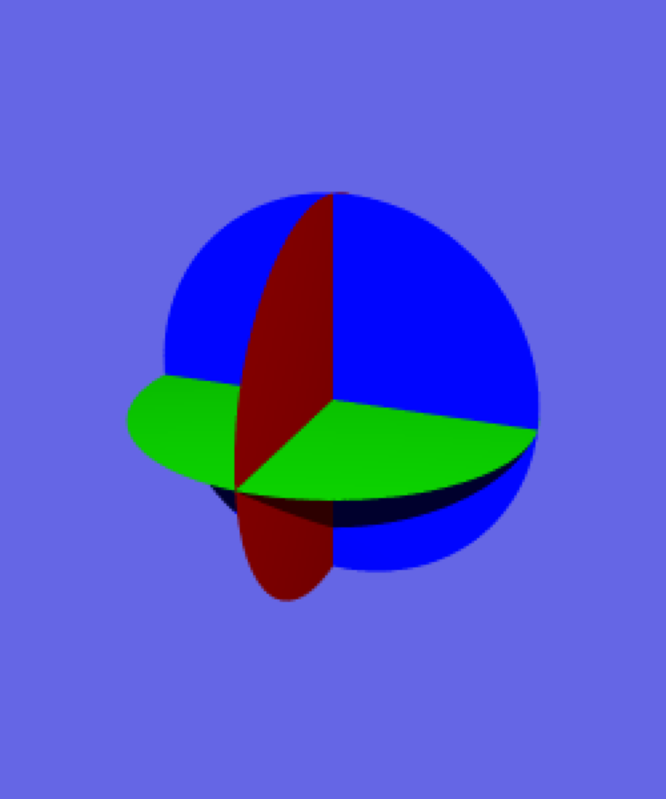
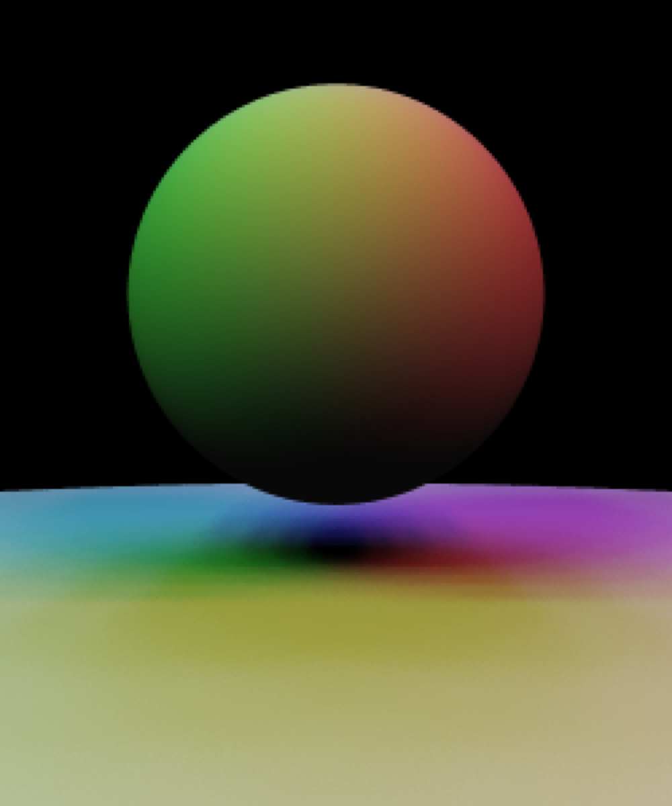

# Ray Tracer 

A simple ray tracing renderer program using three.js that renders spheres and disks illuminated by a light source. Supports area lights, distribution ray tracing, soft shadows, anti-aliasing, and reflection.

This project was for CS 3451 Computer Graphics course taught by Professor Blair MacIntyre at Georgia Tech. The setup of the project and all the test cases were provided by the professor. I implemented the functions that is listed in the Scene Description Language section.

## Try the ray tracer on your machine!

1. cd into the directory and run ```npm install```
2. run with ```npm run dev```
3. visit ```http://localhost:3000/```

NOTE: Some scene with higher sample level and jittering will take a REALLY long time to render, since the primarily purpose of this project was to learn the basics of ray tracing and it is not the most efficient implementation. For testing the features, setting sample level to 4 is enough to produce a smooth scene. 

### Scene Selection

Select the scene you want to render. The last scene (Three Spheres with Disk and Area Light) is a great way to test all the features for this ray tracer.

### Sample Level

Amount of rays shot per-pixel for anti-aliasing and soft shadows. For level = 1, the default, just a single ray will be shot per-pixel, and all shadows will be hard shadows. For integer values of level greater than one, you will shoot multiple rays per pixel, and these rays will be spaced evenly through different sub-pixels in the pixel in a square grid pattern. When level = 2, you will shoot 2 x 2 = 4 rays, and so on.

### Reflection

Enable reflection of surfaces. This feature will work best with the last scene.

### Jitter

When jitter is turned on, it will add a slight bit of randomness to the eye rays and the positions of sample on the rectangle for area light sources. The result will be that the antialiasing and soft shadows will be more smooth than what you get without jitter.

## Project Goals

1. Initialize the scene
2. Cast eye rays for each pixel
3. Implement detection of ray intersection with spheres
4. Implement the shading equation
5. Create disk objects, including a ray/disk intersection routine 
6. Create area light sources
7. Enable shadow creation by light sources
8. Shoot multiple rays per pixel (super-sampling), and use these for anti-aliasing. 
9. Create multiple light rays per surface point being shaded, and use these for soft shadows as well as a specular highlights
10. Implement reflection using recursion

## Results

Below are the images that the program generates for the sample scenes.

           

Here are the images with sample level 4 and jittering on. The silhouettes of objects blend together more cleanly instead of showing stair-steps, the shadows is smoother, and the specular highlights is filled in. 

           

If we zoom in on the final scene, we can see the antialiasing on the sphere edges, the area shadows (combined with the sharp point shadow) and the highlights from the area and point light.


Here is this final image, with various levels of antialiasing and non-jittered distributions:

    

Here is this same final image, with jittered distributions:

    

Especially without only 1 ray, or with a small number of rays, you can see very dramatic differences between the two, with the results getting better as the number of rays increases.

Here is this images from above with reflection, stating with no distribution and continuing with jittered distributions above:

      

Finally, here is a high quality (Sample Level = 10, Jitter on, Reflection on) run at full resolution:


## Scene Description Language

Below are the function descriptions I had to implement for this project. The descriptions are written by Professor Blair MacIntyre.

#### `reset_scene ()`

Initialize all the data structures and variables so you can start with an empty scene.

#### `set_background (r, g, b)`

Sets the background color. If a ray misses all the objects in the scene, the pixel should be given this color.

#### `set_fov (angle)`

Specifies the field of view (in degrees) for perspective projection.  You will need to convert this to the focal length d.  You will then use this together with the eye position and the u, v, and w vectors of the eye's rotation matrix to create the eye rays.

#### `set_eye (cx, cy, cz, lx, ly, lz,  ux, uy, uz)`

Specifies the eye position (cx,cy,cz) in 3D coordinates along with a lookat point (lx,ly,lz) that define the position and direction the camera is looking. An up vector (ux, uy, uz) allows you to set the full orientation of the camera.

#### `new_light (r, g, b, x, y, z)`

Create a point light source at position (x,y,z) and its color (r, g, b). Your code should allow at least 10 light sources. For the second part of this assignment, you will cause these lights to cast shadows.

#### `ambient_light (r, g, b)`

Create an "ambient" light with color (r, g, b), in order to approximate indirect illumination. There is only one ambient light; multiple calls will just replace the ambient light.

#### `new_sphere  (x, y, z, radius, dr, dg, db, k_ambient, k_specular, specular_power)`

Specifies the creation of a sphere with its center at (x, y, z) and with a given radius.  The diffuse color of the sphere is given by (dr, dg, db).  The coefficient k_ambient specifies how much of the ambient light combines with the diffuse color of the surface.  For this project, we will assume that all specular highlights are white, and the brightness of the highlight is given by k_specular. The tightness of the highlight is guided by specular_power.

#### `new_disk  (x, y, z, radius, nx, ny, nz, dr, dg, db, k_ambient, k_specular, specular_power, vx?: number, vy?: number, vz?: number)`

Specifies the creation of a disk with its center at `c = (x, y, z)`, with a given `radius`, and with a surface normal `n = (nx, ny, nz)`.  The diffuse color of the sphere is given by `dr, dg, db`.  The coefficient `k_ambient` specifies how much of the ambient light combines with the diffuse color of the surface.  For this project, we will assume that all specular highlights are white, and the brightness of the highlight is given by `k_specular`. The tightness of the highlight is guided by `specular_power`. 

#### `area_light (r, g, b, x, y, z, ux, uy, uz, vx, vy, vz)`

Create an area light source at center position `c = (x,y,z)` and its color `(r, g, b)`. Your code should allow at least 10 area light sources.  The vectors `u = (ux, uy, uz)` and `v = (vx, vy, vz)` define a rectangle that gives off light. Specifically, points on the light source can be parameterized by values `s` and `t` in the range of `[-1, 1]`, which define points at positions `p = c + su + tv`. 

When only a single eye ray (no distribution) is used, area lights behave similarly to point lights, shooting a single light ray to their center point.

When more than one ray is used for each pixel (set by the `set_sample_level()` command), you should calculate shadows based on distribution ray tracing.  For each of the rays for a given pixel, you will calculate a distribution of sample positions on the area light source and use them as the light positions for shadow rays. You should calculate these sample positions on the area light by varying s and t in a grid pattern, l. 

For each of these rays you will compute the light contribution in two steps.  For the diffuse contribution, you should compute the contribution per ray, including shadowing, and then average the contribution for all light rays.  For the specular component, if any of the light rays is not shadowed, then you should compute the full specular contribution for that point.

As with point light sources, you do not actually draw the area light sources.  

#### `set_sample_level (level)`  

This method saves the sample level. The `level` is the amount of rays that will be shot per-pixel, for the purposes of anti-aliasing and soft shadows (distribution ray tracing). For level = 1, the default, just a single ray will be shot per-pixel, and all shadows will be hard shadows. For integer values of level greater than one, you will shoot multiple rays per pixel, and these rays will be spaced evenly through different sub-pixels in the pixel in a square grid pattern.  When level = 2, you will shoot 2 x 2 = 4 rays.  For level = 3, shoot 3 x 3 = 9 rays.  In general, you will shoot level x level rays per pixel. The final color of a pixel should be the average of the colors from each of these rays.

When using area light sources (see above) you will be shooting shadow rays towards various parts of the area light sources.  This will give you the effect of soft shadows.

This command is not found in any specific test scene.  Instead, various levels of sampling are set by typing one of the following characters before you render a scene: "qwertyuiop".   Typing "q" sets the sample level to 1.  Typing "w" sets it to 2, and so on up to "p" setting the sample level to 10 (which cause 10x10 = 100 rays to be shot per pixel).

#### `jitter_off()`

This is the default setting for whether to perform jittered sampling.  When jitter is off, you will use a regular grid pattern for creating the position samples on area light sources. Your "soft" shadows will look like overlapping dark regions. Like the `set_sample_level()` command, this command is not used in any particular scene.  Instead, you type the character "n" before rendering a given scene.

#### `jitter_on()`

When jitter is turned on, you will add a slight bit of randomness to the eye rays and the positions of sample on the rectangle for area light sources.  The result will be that your antialiasing and soft shadows will be more smooth than what you get without jitter.  The soft shadows may appear to be noisy for small values used in `set_sample_level()`.  When using higher sample levels, the noise will be reduced.  Type the letter "j" before rendering a scene to call this command.  The regular grid and jittered samples should be selected as described on this slide in the recorded lecture.


#### `reflection_on()`and `reflection_off()`

An optional extra credit part of the assignment is to implement reflected rays (see below).  Pressing the "g" key turns on reflected rays, and "v" turns off reflected rays.  Default is off.

#### `draw_scene()`

Ray-traces the scene and displays the image in the canvas region in your browser.  We have provided this method, but you will need to implement two internal methods, `traceRay(ray)` and `eyeRay(i,j)`, that this method calls.